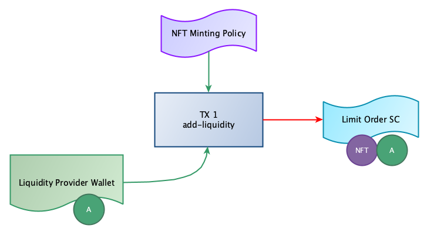
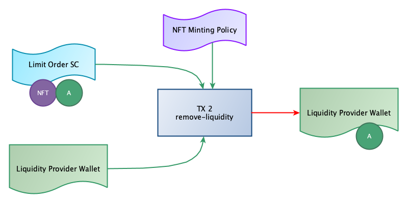
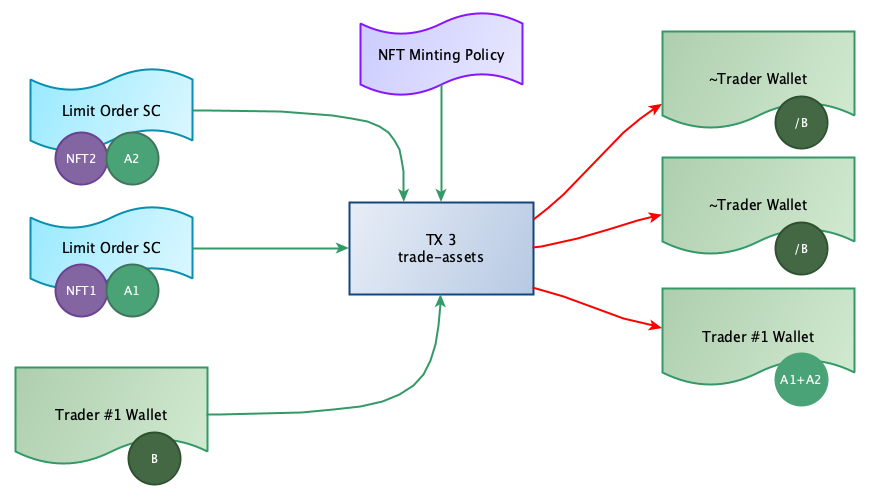

# Order book project (Cardano Developer Professional)

In addition to the high-level overview of the project presented in this document, 
also consult:

- `order-book-contracts/README.md` 
  Includes instructions on how to run the test suite and documentation that 
  describes each test scenario. Go through this document to understand how 
  the application works in more detail.

- `mock-order-book/README.md` 
  Provides a justification for the mock order book API and instructions for 
  running its test suite.

## Overview

This repository is my submission for the final project in the Cardano Developer Professional 
course delivered by EMURGO.

It is a decentralised application that implements a basic order book. Users are able to 
submit limit orders to buy or sell a particular currency pair at a specific price. This 
action is known as "adding liquidity" in the application.

If a currency pair has enough liquidity on the bid or ask side of the market, a 
user is also able to submit market orders to trade a particular currency pair. As an 
example, for the arbitrary pair ADA/AUSD, a user is able to trade (swap) ADA for AUSD by 
selling ADA at the current ask price in the order book. On the other hand, a user is also 
able to buy ADA, which will involve submitting a market order to sell ADA for AUSD at the 
current ask price for the currency pair.

See the limitations section to discover what is not possible with this system out-of-the-box.

The project includes:
- A mock order book structure and API for simulating how a basic order book would behave 
  with the eUTxO model in a Plutus application.
- Plutus smart contracts (on-chain code) that enable submitting limit orders and executing
  market orders on the blockchain.
- Plutus off-chain code that define callable endpoints to perform specific actions that 
  can be taken by users (wallets). These endpoints construct transactions which are then 
  submitted to the blockchain.

## Participants 

The Dapp will be used by traders whose goal is to trade one asset for another at 
specific price levels. Traders who wish to swap one asset for another at a specific 
price level will submit limit orders by depositing liquidity to the script address. 

On the other hand, traders who want to simply trade one asset for another at any 
price level will submit market orders. In this case, assets are bought and sold 
at the order book's current bid and ask prices.

Dapp participants are summarised here:

- **Liquidity providers** (limit orders) 
  Users who want to buy or sell an asset for a particular price will produce outputs 
  at the script address in the form of limit orders. These outputs will store one of 
  the assets in the currency pair being traded. The script output datum stores 
  information, such as the limit price to trade at, in order to satisfy limit orders.

- **Traders** (market orders) 
  Users who want to trade an asset pair, or swap one asset for another, will submit 
  market orders. A market order will swap one asset with another (a currency pair 
  is chosen) according to the order book's current bid or ask price.

## Actions

The order book application provides three endpoints that wallets can interact with, which 
are:

- `add-liquidity` 
  This action is analogous to a limit order. It allows wallets to deposit native assets 
  at the script adress and specify a price that they are willing to trade that asset with 
  the corresponding asset in the currency pair.
- `remove-liquidity` 
  Wallets are also able to cancel a limit order and get back their liquidity at any time
  after depositing liquidity. As script outputs store an NFT which can uniquely identify
  who "owns" that output, off-chain code is able to lookup a correct output in order to 
  cancel a limit order and refund a wallet.
- `trade-assets` 
  This endpoint enables a wallet to trade a particular currency pair by executed a market
  order. It queries the order book system off-chain to locate the correct outputs to consume 
  on-chain. For example, the current bid and ask prices are queried, and particular information 
  is retreieved off-chain, such as NFT asset classes for identifying which outputs to consume
  for executing the market order successfully.

## NFT Usage

Each script output will store an NFT which is used to uniquely identify wallets (traders) 
interacting with the application.

NFT data is stored off-chain in the order book structure to determine which script 
outputs will be consumed at specific price levels. For example, a market order is 
constructed by querying the order book off-chain, which will return a list of limit orders
at the current bid/ask price. Limit orders retrieved off-chain store an NFT which directly 
"points" to the output to be consumed on-chain.

The parameterised NFT policy script also checks whether the correct assets are being 
deposited when an output is produced at the script address.

## eUTxO Diagrams

### Adding Liquidity

A wallet can add liquidity to a contract parameterized with a particular currency pair. This 
currency pair can be traded after liquidity is stored on the block chain in the form of 
fragmented UTxOs under a parameterized script address. 

The diagram above illustrates that a wallet who wishes to provide liquidity interacts with 
an endpoint called `add-liquidity`. This endpoint constructs a transaction that takes the NFT 
minting policy script and assets from the wallet who wants to trade. The transaction 
produces an output at the parameterized script address for the currency pair being traded. It
stores an NFT to uniquly identify the ouput along with an asset to be traded.

### Removing Liquidity

Conversely, a trader can remove liquidity from a parameterized script address to "cancel" 
their limit order and get back any deposited assets. 

An endpoint named `remove-liquidity` is called to cancel a limit order and refund assets to 
the wallet that originally added liquidity. The transaction to perform this action requires 
the correct script UTxO to consume as input, along with the NFT policy script whose job is 
to now burn the NFT stored in the input UTxO being consumed. 

After successful validation, deposited liquidity will be sent back to the original wallet.

### Trading Assets

In order to trade a currency pair, a wallet will construct a market order to either buy or 
sell an asset, and expect to receive a certain amount of the opposite currency in the trade 
pair, based on the order book's current ask or bid price.

The diagram above illustrates a simple trade where a wallet wishes to trade Asset B with 
Asset A. According to the diagram, this transaction will consume two script outputs to fully
fulfill this market order. The NFT minting policy is again required by the transaction in 
order to burn NFTs stored in script UTxOs. 

The result of this trade will see Asset B sent to the wallets who produced the script UTxOs
being consumed in this transaction. The wallet executing the market order will receive Asset A in 
return. The smart contracts will guarentee that Asset A is swapped at the correct limit price 
(exchange rate).

## Limitations

### No partial order filling

In order for a market order to be successfully validated on the blockchain, it must match 
limit orders fully such that limit order UTXOs (script outputs) are fully consumed. To 
demonstrate this limitation, consider the following scenario for the arbitrary currency pair 
ADA/AUSD:

- User A submits a limit order to SELL 10 ADA at the ask price of 2 AUSD.
- User B submits a limit order to SELL 15 ADA at the ask price of 3 AUSD.
- User C submits a market order to BUY 25 ADA for 65 ((2 * 10) + (3 * 15)) AUSD.

In this scenario, User C submits a market order to buy 25 ADA. This order will be validated 
successfully because it spends the two limit orders submitted by User A and User B in full. 
Ie. The UTXOs are fully consumed.

If User C wanted to buy 20 ADA, this would not be possible because it would require a partially 
filled limit order, which is currently not a feature of this basic order book application.

### Limit prices must not "overtake" the opposite side of the market

This limitation is down to how the mock order book code works, and has nothing to do with the 
smart contracts. To overcome this limitation, a more sophisticated off-chain order book system 
would need to be intregated into the application to replace the mock order book code. For example,
a database and oracle feed would be two major components needed in a production environment to 
monitor the bid and ask prices, and allow limit orders to be submitted at any limit price, on 
either side of the market.

To demonstrate this limitation, consider the following scenario:

- User A submits a limit order to SELL 10 ADA at the ask price of 4 AUSD.
- User B submits a limit order to BUY 10 ADA at the ask price of 2 AUSD.

At this point, the current **Ask** price is 4 AUSD and the current **Bid** price is 2 AUSD. 
As a result, the mock order book system has cached these bid and ask prices, and will 
use them when "taking" limit orders when executing market orders.

Due to the way the mock order book system works, a new BUY limit order with a __bid price greater 
than or equal to the current ask price__ would be rejected. On the other side of the market, a new 
SELL limit order with an __ask price less than or equal to the current bid price__ would also be 
rejected. 

To sum up this limitation, anyone using the mock order book code for testing is forced to follow 
these rules:

- Submit BUY limit orders with a bid price <= current ask price
- Submit SELL limit orders with an ask price >= current bid price

This limitation also implies that market orders are the only means to mutate, or change, the 
order book's bid and ask prices.

## Improvements

- Partial filling of limit orders 
  Would require a more sophisticated off-chain order book system that can both cache on-chain data
  and monitor the current bid and ask prices of currency pairs.
